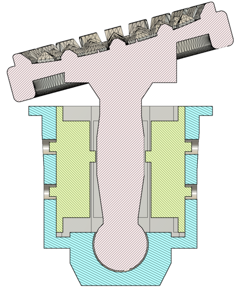

# 1u_mx_dpad

This is a DIY dpad that can be placed within the bounds of any Cherry MX switch mounting hole. I am currently using this in my [Splitcore keyboard](https://github.com/dmhuisma/splitcore-zmk).

## Instructions

This requires 4 microswitches, such as the "Kailh blue dot mini micro", or another with the same dimensions.

Solder wires to the switches

Glue the switches, I used CA glue.

Insert the stem and place into an available 1u Cherry MX switch location on your keyboard.

## Credits

General idea - https://old.reddit.com/r/MechanicalKeyboards/comments/gjsm7s/navigator_quad_dpad_split_ergo_wip/

Thumbstick - https://www.thingiverse.com/thing:5967901
